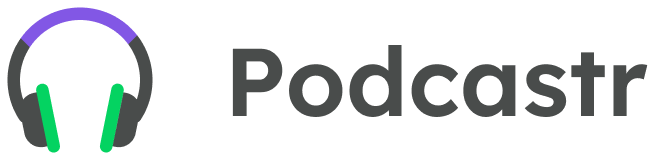

<p align='center'></p>
<h1 align='center'>Podcastr</h1>
<p align='center'>


</p>

## 🔖 Descrição
<p>🎧 Podcastr, projeto criado na 5ª edição da Next Level Week disponibilizada pela Rocketseat.<p>

## 🚀 Tecnologias
Esse projeto está utilizando as seguintes tecnologias:
- HTML
- CSS
- JavaScript
- [NextJs](https://nextjs.org/)
- [Typescript](https://www.typescriptlang.org/)
- [Sass](https://sass-lang.com/)
- [JSON Server](https://github.com/typicode/json-server)


## 🎲 Como utilizar
```bash
# Clone esse repositório
$ git clone https://github.com/rafaasimi/podcastr-nextlevelweek.git

# Navegue até o repositório do projeto
$ cd podcastr-nextlevelweek

# Instale as dependências
$ yarn install

# Inicie o projeto
$ yarn dev
```

<h3>🖼 Layout</h3>


## 📝 Licença
<p>O projeto se encontra sob licença MIT. Para mais detalhes, acesse <a href='LICENSE'>license<a>.</p>

---
<p>Criado com 💙 por <a href='https://github.com/rafaasimi/' target='_blank'>Rafael Simionato</a></p>